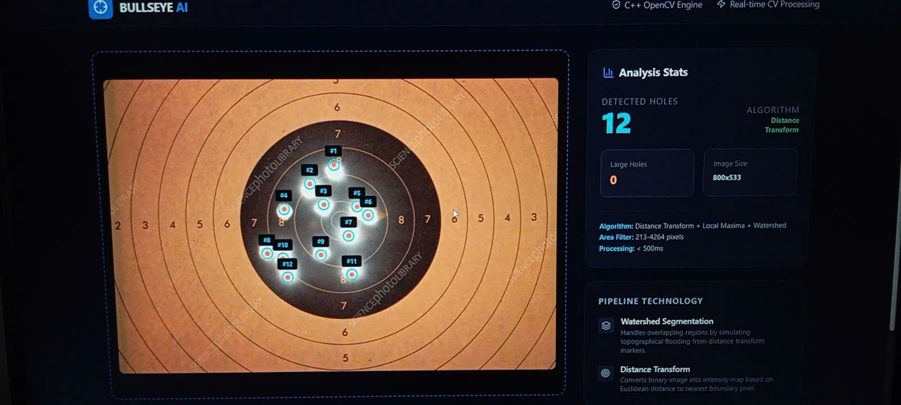

# Bullseye AI — Bullet Hole Analyzer

Ứng dụng phân tích ảnh bia bắn bằng C++ OpenCV (backend) và React + Vite (frontend). Backend cung cấp API `/detect` để nhận ảnh và trả về tọa độ lỗ đạn, frontend hiển thị kết quả trực quan.

## Yêu cầu

- Node.js 18+
- C++ compiler (g++)
- OpenCV 4 (pkg-config)

## Chạy backend (C++ API)

Từ thư mục gốc:

1. Build:
	- `g++ -I./api api/server.cpp -o api/server -std=c++17 $(pkg-config --cflags --libs opencv4) -lpthread`
2. Run:
	- `./api/server`

Server chạy tại `http://localhost:8080`.

### Endpoint

- `GET /health` → `ok`
- `POST /detect` → nhận body là ảnh (binary) và trả JSON gồm `count`, `coordinates`, `imageWidth`, `imageHeight`, `areaThresholds`.

## Chạy frontend (React)

1. Cài deps:
	- `npm install`
2. Chạy dev server:
	- `npm run dev`

Frontend mặc định gọi API qua proxy `/detect` và `/health` sang `http://localhost:8080`.

## Kết quả 

## Ghi chú

- Nếu frontend báo lỗi “Failed to fetch”, hãy đảm bảo backend đang chạy và không bị chiếm cổng 8080.
- Muốn cấu hình API base URL khác, đặt biến môi trường `VITE_API_BASE_URL` (ví dụ `https://your-domain.com`).

## Bản quyền

Copyright © 2026 Luna777247. All rights reserved.